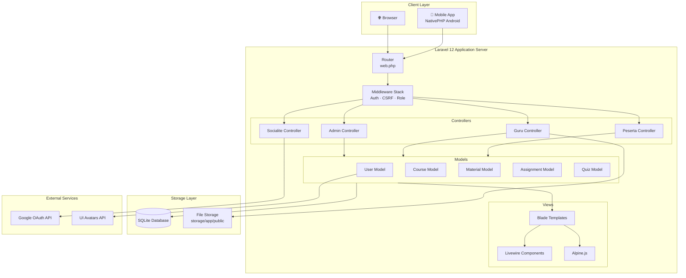
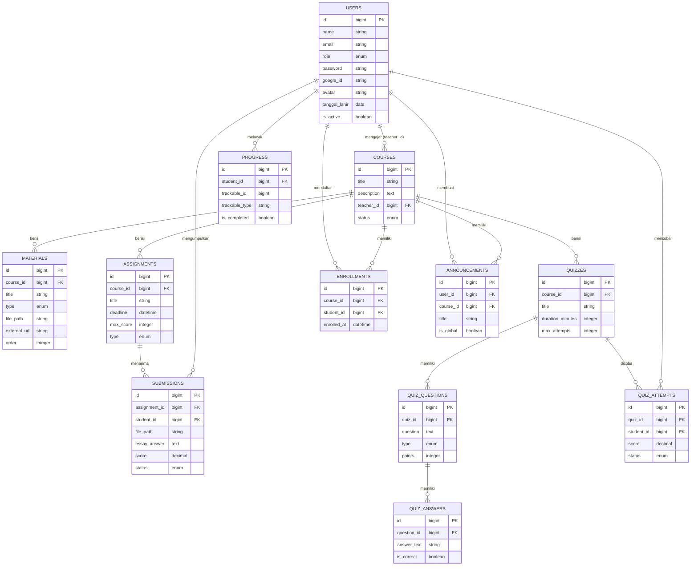
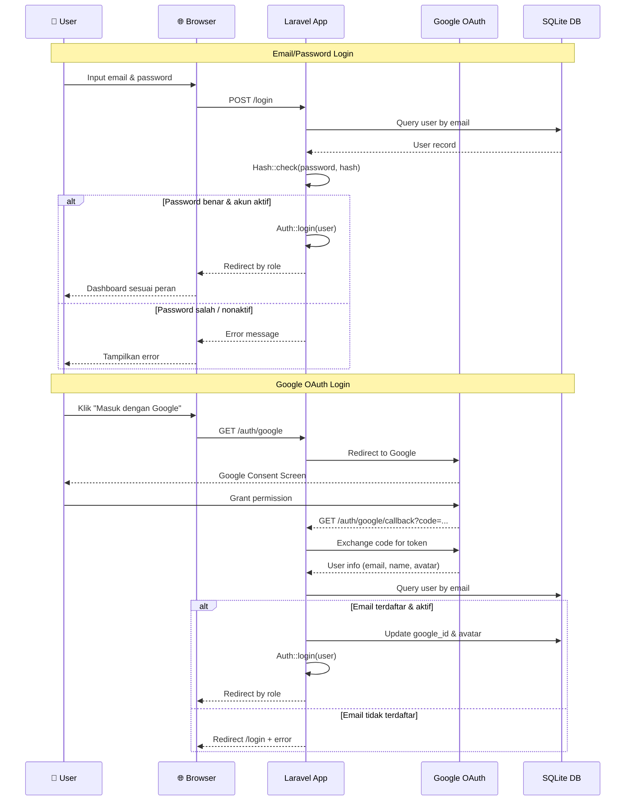
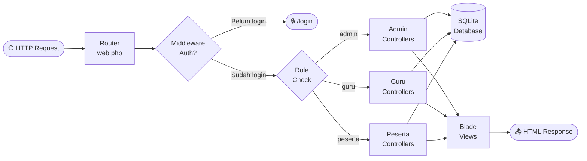

# Architecture Diagram — BTQR LMS

> Platform Learning Management System untuk Bait Tahfiz Al-Quran Ridhallah  
> Dibangun dengan **Laravel 12**, **PHP 8.4**, **NativePHP**, **Livewire 3**, **Alpine.js**, **Tailwind CSS**

---

## 1. Penjelasan Arsitektur

BTQR LMS menggunakan arsitektur **Monolitik Berlapis (Layered Monolith)** dengan pola **MVC (Model-View-Controller)** yang diimplementasikan di atas framework Laravel 12.

### Lapisan Arsitektur

```
┌─────────────────────────────────────────────────────────────┐
│                     PRESENTATION LAYER                       │
│  Blade Templates · Livewire Components · Alpine.js · Vite   │
├─────────────────────────────────────────────────────────────┤
│                     APPLICATION LAYER                        │
│      Controllers · Middleware · Form Requests · Events       │
├─────────────────────────────────────────────────────────────┤
│                       DOMAIN LAYER                           │
│        Eloquent Models · Relationships · Scopes              │
├─────────────────────────────────────────────────────────────┤
│                    INFRASTRUCTURE LAYER                       │
│      SQLite Database · File Storage · Google OAuth           │
└─────────────────────────────────────────────────────────────┘
```

### Prinsip Desain
- **Single Responsibility**: Setiap controller hanya menangani satu domain (Admin, Guru, Peserta)
- **Role-Based Access Control (RBAC)**: Middleware `RoleMiddleware` memfilter akses berdasarkan peran
- **Convention over Configuration**: Mengikuti konvensi Laravel untuk naming dan struktur direktori
- **DRY (Don't Repeat Yourself)**: Layout Blade yang dapat diwariskan, komponen yang dapat digunakan ulang

---

## 2. Alur Data (Data Flow)

### Request Lifecycle

```
Browser/Mobile App
      │
      ▼
[HTTP Request]
      │
      ▼
┌─────────────┐
│  web.php    │ ← Route Matching
│  (Router)   │
└──────┬──────┘
       │
       ▼
┌─────────────────────┐
│  Global Middleware  │ ← EncryptCookies, CSRF, Auth
│  - Authenticate     │
│  - VerifyCsrfToken  │
└──────────┬──────────┘
           │
           ▼
┌──────────────────────┐
│   RoleMiddleware     │ ← role:admin / role:guru / role:peserta
│   (Authorization)    │
└──────────┬───────────┘
           │
           ▼
┌──────────────────────┐
│    Controller        │ ← Business Logic
│  (Admin/Guru/Peserta)│
└──────────┬───────────┘
           │
      ┌────┴────┐
      ▼         ▼
┌──────────┐ ┌──────────┐
│  Model   │ │   View   │
│(Eloquent)│ │ (Blade)  │
└────┬─────┘ └────┬─────┘
     │             │
     ▼             ▼
┌─────────┐  ┌──────────┐
│ SQLite  │  │ Response │ → Browser
│   DB    │  │  (HTML)  │
└─────────┘  └──────────┘
```

### Alur Data Upload Materi

```
Guru Upload File
      │
      ▼
MaterialController@store
      │
      ├── Validasi (file|max:51200)
      │
      ├── Storage::disk('public')->put()
      │         └── storage/app/public/materials/
      │
      ├── Material::create([...])
      │         └── materials table (SQLite)
      │
      └── Redirect → guru.courses.show
                      └── Flash: "Materi berhasil ditambahkan"
```

---

## 3. Authentication Flow

### A. Email & Password Login

```
User Input (email + password)
          │
          ▼
POST /login → AuthenticatedSessionController
          │
          ├── Auth::attempt(['email', 'password'])
          │         │
          │         ├── [FAIL] → Redirect /login + Error
          │         │
          │         └── [SUCCESS] ──────────────────────┐
          │                                              │
          ▼                                              ▼
    Check is_active                          Session::regenerate()
          │
          ├── [FALSE] → Logout + "Akun nonaktif"
          │
          └── [TRUE] → Redirect by Role
                         │
                         ├── admin   → /admin/dashboard
                         ├── guru    → /guru/dashboard
                         └── peserta → /peserta/dashboard
```

### B. Google OAuth Flow

```
User klik "Masuk dengan Google"
          │
          ▼
GET /auth/google → SocialiteController@redirect
          │
          └── Socialite::driver('google')->redirect()
                         │
                         ▼
              [Google OAuth Consent]
                         │
                         ▼
GET /auth/google/callback → SocialiteController@callback
          │
          ├── $googleUser = Socialite::driver('google')->user()
          │
          ├── User::where('email', $googleUser->email)->first()
          │         │
          │         ├── [NOT FOUND] → Redirect /login + "Email tidak terdaftar"
          │         │
          │         └── [FOUND] ─────────────────────────┐
          │                                               │
          ▼                                               ▼
    Check is_active                          Update google_id & avatar
          │                                               │
          ├── [FALSE] → "Akun dinonaktifkan"              │
          │                                               ▼
          └── [TRUE] → Auth::login($user) → Redirect by Role
```

### C. Password Reset (Default)

```
Admin Reset Password
          │
          ▼
POST /admin/users/{id}/reset-password
          │
          ├── Ambil tanggal_lahir user
          │
          ├── Format: Carbon::parse(tanggal_lahir)->format('dmy')
          │         └── Contoh: "07-07-2005" → "070705"
          │
          ├── Hash::make(password_baru)
          │
          └── User::update(['password' => hash])
```

---

## 4. Mermaid Diagram Code

### System Architecture



### Entity Relationship



### Authentication Flow



---

## 5. Diagram Horizontal (Landscape View)

### Request Flow (Horizontal)



### Deployment Architecture (Horizontal)

```
┌──────────────────────────────────────────────────────────────────────────────┐
│                         PRODUCTION ENVIRONMENT                                │
│                                                                               │
│   ┌─────────────┐    ┌─────────────┐    ┌───────────────┐    ┌────────────┐ │
│   │   Browser   │───▶│  Nginx/     │───▶│  PHP-FPM 8.4  │───▶│  SQLite   │ │
│   │   (HTTPS)   │    │  Apache     │    │  Laravel 12   │    │  Database │ │
│   └─────────────┘    └─────────────┘    └───────┬───────┘    └────────────┘ │
│                                                   │                           │
│   ┌─────────────┐                         ┌───────▼───────┐    ┌────────────┐│
│   │ Android App │───▶ NativePHP Bridge ──▶│  File Storage │    │  Google   ││
│   │ (NativePHP) │                         │  (storage/)   │    │  OAuth    ││
│   └─────────────┘                         └───────────────┘    └────────────┘│
└──────────────────────────────────────────────────────────────────────────────┘
```

### Module Dependency (Horizontal)

```
[routes/web.php]
     ├──▶ [Middleware: Authenticate]  ──▶ [Auth\LoginController]
     ├──▶ [Middleware: RoleMiddleware] ──▶ [Admin\DashboardController]
     │                                      [Admin\UserController]
     │                                      [Admin\CourseController]
     ├──▶ [Middleware: RoleMiddleware] ──▶ [Guru\DashboardController]
     │                                      [Guru\CourseController]
     │                                      [Guru\MaterialController]
     │                                      [Guru\AssignmentController]
     │                                      [Guru\QuizController]
     └──▶ [Middleware: RoleMiddleware] ──▶ [Peserta\DashboardController]
                                           [Peserta\CourseController]
```

---

## 6. Component Diagram (Detail)

### Frontend Components

```
resources/views/
├── layouts/
│   ├── app.blade.php          ← Layout utama (sidebar + header)
│   └── guest.blade.php        ← Layout untuk halaman auth
│
├── components/                ← Breeze UI Components
│   ├── primary-button.blade.php
│   ├── input-label.blade.php
│   ├── text-input.blade.php
│   ├── input-error.blade.php
│   ├── modal.blade.php
│   └── dropdown.blade.php
│
├── auth/                      ← Halaman Autentikasi
│   ├── login.blade.php        ← Login + Google OAuth button
│   ├── register.blade.php
│   ├── forgot-password.blade.php
│   └── reset-password.blade.php
│
├── admin/                     ← Panel Administrator
│   ├── dashboard.blade.php    ← Statistik global
│   ├── users/
│   │   ├── index.blade.php    ← Tabel pengguna + filter
│   │   ├── create.blade.php   ← Form buat pengguna
│   │   └── edit.blade.php     ← Form edit pengguna
│   └── courses/
│       ├── index.blade.php    ← Tabel kelas
│       ├── create.blade.php   ← Form buat kelas
│       └── edit.blade.php     ← Form edit kelas
│
├── guru/                      ← Panel Guru
│   ├── dashboard.blade.php    ← Ringkasan kelas yang diampu
│   ├── courses/
│   │   ├── index.blade.php    ← Grid kelas
│   │   └── show.blade.php     ← Tab: Materi/Tugas/Quiz/Pengumuman
│   ├── materials/
│   │   ├── create.blade.php   ← Form tambah materi
│   │   └── edit.blade.php     ← Form edit materi
│   ├── assignments/
│   │   ├── create.blade.php   ← Form buat tugas
│   │   └── show.blade.php     ← Daftar pengumpulan + form nilai
│   └── quizzes/
│       ├── create.blade.php   ← Form buat quiz
│       └── show.blade.php     ← Kelola pertanyaan + hasil
│
└── peserta/                   ← Panel Santri
    ├── dashboard.blade.php    ← Kelas terdaftar + pengumuman
    ├── courses/
    │   └── show.blade.php     ← Tab: Materi/Tugas/Quiz
    └── quizzes/
        └── attempt.blade.php  ← Form quiz + countdown timer
```

### Backend Components

```
app/
├── Http/
│   ├── Controllers/
│   │   ├── Admin/
│   │   │   ├── DashboardController.php  ← Statistik global
│   │   │   ├── UserController.php       ← CRUD pengguna
│   │   │   └── CourseController.php     ← CRUD kelas + enroll
│   │   ├── Guru/
│   │   │   ├── DashboardController.php  ← Ringkasan kelas
│   │   │   ├── CourseController.php     ← Lihat kelas sendiri
│   │   │   ├── MaterialController.php   ← CRUD materi + file upload
│   │   │   ├── AssignmentController.php ← CRUD tugas + penilaian
│   │   │   └── QuizController.php       ← CRUD quiz + pertanyaan
│   │   ├── Peserta/
│   │   │   ├── DashboardController.php  ← Dashboard santri
│   │   │   └── CourseController.php     ← Akses kelas + submit
│   │   ├── Auth/
│   │   │   └── SocialiteController.php  ← Google OAuth
│   │   └── AnnouncementController.php   ← CRUD pengumuman
│   └── Middleware/
│       └── RoleMiddleware.php           ← Cek peran pengguna
│
└── Models/
    ├── User.php           ← Autentikasi + peran + avatar
    ├── Course.php         ← Kelas + relasi guru/santri
    ├── Material.php       ← Materi + file URL accessor
    ├── Assignment.php     ← Tugas + isOverdue()
    ├── Submission.php     ← Pengumpulan + file
    ├── Quiz.php           ← Quiz + batas waktu
    ├── QuizQuestion.php   ← Pertanyaan quiz
    ├── QuizAnswer.php     ← Pilihan jawaban
    ├── QuizAttempt.php    ← Percobaan quiz + skor
    ├── Enrollment.php     ← Pendaftaran kelas
    ├── Announcement.php   ← Pengumuman kelas/global
    ├── Progress.php       ← Progress belajar (polymorphic)
    └── Certificate.php    ← Sertifikat (future)
```

### Database Schema (13 Tabel)

```
┌────────────────────────────────────────────────────────────────────┐
│                         SQLite Database                             │
│                                                                     │
│  users ──────────────────────────────────────────────────────────  │
│  │ id · name · email · password · role · google_id               │  │
│  │ avatar · tanggal_lahir · is_active                            │  │
│  │                                                               │  │
│  ├──[teacher_id]──▶ courses ──────────────────────────────────  │  │
│  │                  │ id · title · description · status          │  │
│  │                  │                                            │  │
│  │                  ├──▶ materials ─────────────────────────── │  │
│  │                  │    id · title · type · file_path           │  │
│  │                  │                                            │  │
│  │                  ├──▶ assignments ───────────────────────── │  │
│  │                  │    id · title · deadline · max_score       │  │
│  │                  │    │                                        │  │
│  │                  │    └──▶ submissions ──────────────────── │  │
│  │                  │         id · file_path · score · status    │  │
│  │                  │                                            │  │
│  │                  └──▶ quizzes ───────────────────────────── │  │
│  │                       id · title · duration · max_attempts    │  │
│  │                       │                                        │  │
│  │                       ├──▶ quiz_questions ─────────────────  │  │
│  │                       │    │                                   │  │
│  │                       │    └──▶ quiz_answers                   │  │
│  │                       │                                        │  │
│  │                       └──▶ quiz_attempts                       │  │
│  │                                                                │  │
│  ├──[student_id]──▶ enrollments (pivot) ─────────────────────  │  │
│  ├──[student_id]──▶ submissions                                │  │
│  ├──[student_id]──▶ quiz_attempts                              │  │
│  ├──[student_id]──▶ progress (polymorphic)                     │  │
│  └──[user_id]────▶ announcements                               │  │
│                                                                     │
└────────────────────────────────────────────────────────────────────┘
```

---

## 7. Ringkasan Teknologi

| Kategori | Teknologi | Versi | Fungsi |
|----------|-----------|-------|--------|
| **Runtime** | PHP | 8.4 | Server-side scripting |
| **Framework** | Laravel | 12.x | MVC framework utama |
| **Frontend Reaktif** | Livewire | 3.x | Server-driven UI reaktif |
| **Interaktivitas** | Alpine.js | 3.x | JavaScript ringan untuk UI |
| **CSS Framework** | Tailwind CSS | 4.x | Utility-first styling |
| **Build Tool** | Vite | 7.x | Asset bundling |
| **Database** | SQLite | 3.x | Relational database embedded |
| **Auth Provider** | Laravel Breeze | 2.x | Auth scaffolding |
| **OAuth** | Laravel Socialite | 5.x | Google OAuth 2.0 |
| **File Storage** | Laravel Storage | built-in | Upload & akses file |
| **Mobile** | NativePHP Mobile | 3.x | Android app wrapper |
| **Font** | Figtree (Bunny CDN) | — | Typography |
| **Avatar** | UI Avatars API | — | Foto profil default |

### Dependency Graph

```
Laravel 12
    ├── livewire/livewire          (UI reaktif)
    ├── laravel/socialite          (Google OAuth)
    ├── laravel/breeze             (Auth scaffolding)
    ├── nativephp/mobile           (Android support)
    ├── league/flysystem           (File storage)
    └── carbon/carbon              (Date manipulation)

Node.js Dependencies
    ├── tailwindcss                (CSS framework)
    ├── @tailwindcss/vite          (Vite plugin)
    ├── vite                       (Build tool)
    └── alpinejs                   (JS framework)
```

---

## 8. Keamanan & Best Practices

### Implementasi Keamanan

```
1. CSRF Protection ──────────── @csrf token di semua form POST
2. SQL Injection ────────────── Eloquent ORM (prepared statements)
3. XSS Prevention ───────────── Blade {{ }} auto-escape
4. Role Authorization ───────── RoleMiddleware di semua route
5. File Upload Validation ───── MIME type & size validation
6. Password Hashing ─────────── Hash::make() dengan Bcrypt
7. Session Security ─────────── Session::regenerate() pada login
8. Google OAuth ─────────────── Hanya email terdaftar yang bisa login
9. Account Status Check ─────── Validasi is_active saat login
10. Ownership Check ─────────── Guru hanya akses kelas sendiri
```

### Konfigurasi Environment

```bash
# File: btqr-lms/.env

# Aplikasi
APP_NAME="BTQR LMS"
APP_ENV=local|production
APP_DEBUG=false          # Harus false di production!
APP_KEY=base64:...       # Generated: php artisan key:generate

# Database
DB_CONNECTION=sqlite
DB_DATABASE=/path/to/database.sqlite

# Google OAuth
GOOGLE_CLIENT_ID=...
GOOGLE_CLIENT_SECRET=...
GOOGLE_REDIRECT_URI=https://domain.com/auth/google/callback

# Mail (untuk reset password)
MAIL_MAILER=smtp
MAIL_HOST=smtp.gmail.com
MAIL_PORT=587
MAIL_USERNAME=...
MAIL_PASSWORD=...
```

---

*Dibuat dengan ❤️ untuk Bait Tahfiz Al-Quran Ridhallah (BTQR)*  
*Versi Dokumen: 1.0.0 | Laravel 12 | PHP 8.4 | 2026*
